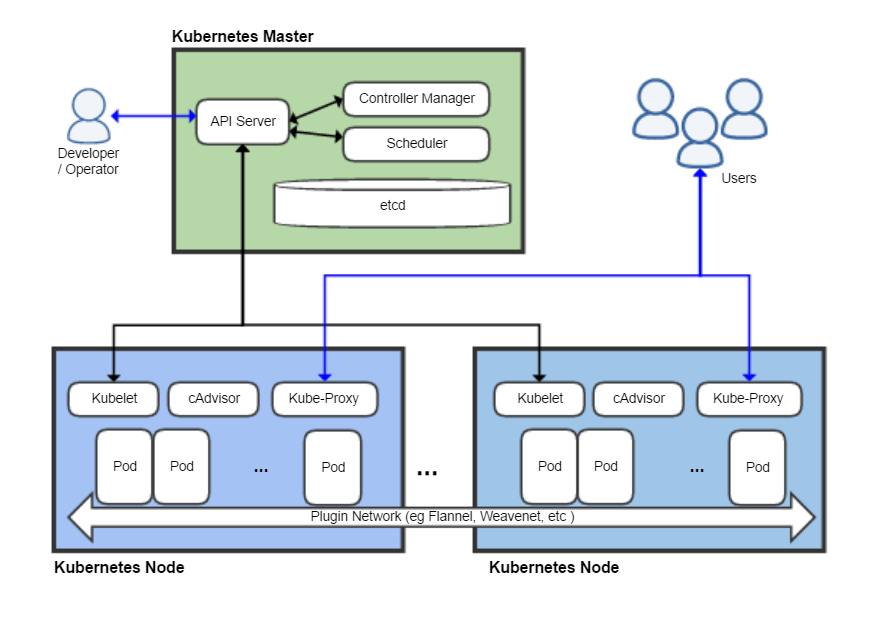

I'll be updating my cheatsheet for Kubernetes as I am learning it.

# 1. Kubernetes Cheatsheet

Kubernetes is the "operating system of the data center"

## 1.1. Why Kubernetes
1. Scaling
   1. Introducing a virtual layer that handles computation makes scaling up super easy
2. Automatic rollouts and rollbacks
3. Service Discovery and Load Balancing
4. Storage Orchestration
5. Self-healing
6. Horizontal Scalability

## 1.2. Kubernetes Architecture

- [Primary/Replica Architecture](https://en.wikipedia.org/wiki/Master%E2%80%93slave_(technology))
  - Has a control plane and nodes (which manages computatio)
  - Etcd: Purpose: Store config data, Properties: Lightweight and consistent
  - API server: Purpose: Proper
  - Scheduler: Purpose: Selects the node that an unscheduled pod runs. Properties: Takes in resource availability on different nodes, resource requirements, quality-of-service, affinity/anti-affinity requirements, data locality, and more to schedule. 

An API request (JSON object), which is a YAML. The scheduler takes in the request and schedules it onto a kubernetes node. The controller manager (fill in). The incoming config is stored into etcd to recover the current cluster state upon failure. The API server receives the scheduler and controller manager responses and schedules to a Kubelet. The Kubelet assigns the work to pods.

cAdvisor 

Diagram

## 1.3. Advanced Features
- How automatic rollouts and rollbacks is done
- etcd Watch API
- Plug-in Network

## 1.4. Appendix
**Containers:**

## 1.5. Resources that I used
- ChatGPT4.5
- [The Kubernetes Book](https://www.amazon.co.uk/Kubernetes-Book-Nigel-Poulton/dp/1521823634)
- [Kubernetes Official Documentation](https://kubernetes.io/)
- [Kubernetes Youtube 4 Hour Courses](https://www.youtube.com/watch?v=X48VuDVv0do&t=5517s&ab_channel=TechWorldwithNana)
- [Kubernetes Wikipedia](https://en.wikipedia.org/wiki/Kubernetes)
- [Primary/Replica Architecture](https://en.wikipedia.org/wiki/Master%E2%80%93slave_(technology))